# Assignment 3 : MGMT 590, Production Scale Data Products, Summer 2021

## Creating Flask Application - Question Answering

Purpose of the this hands-on project was to create a REST API inference server that serves inferences from a Transformers NLP model
The app is deployed at: https://mgmt590-assignment3-streamlit-5tqitwte4q-uc.a.run.app

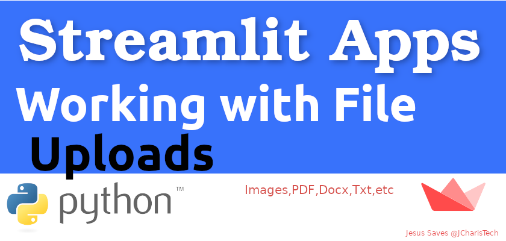


## Learning Outcomes

The objective of this project was to deploy a web app created on the foundation of a REST API created previously. The webapp integrates Natural Language Processing algorithms such as the Hugging Face Transformers to enable automated Question Answering. In brief, Question Answering is method of information retrieval that uses Machine Learning to extract answers for questions asked by humans in natural language. In Extractive Question Answering, a context is provided so that the model can refer to it and make predictions on where the answer lies within the passage.  

Firstly, we created an API. We used Flask, a web framework for Python that provides functionality for building web applications, including managing HTTP requests and rendering templates. The advantage of using Flask is that applications tend to be written on a blank canvas, so to speak, and so are more suited to a contained application such as our prototype API. Further, we used the prevailing design philosophy of modern APIs called REST. REST is based on four methods defined by the HTTP protocol: POST, GET, PUT, and DELETE. These correspond to the four traditional actions performed on data in a database: CREATE, READ, UPDATE, and DELETE. We finally tested our REST API on Google Cloud Run and got desirable results. 

After successfully creating the REST API, the next step was to create a user interface. A user interface is what the final user will experience on the web app. It is built upon a skeleton code which is the REST API. For this purpose, we used the Streamlit framework, in which you can build a browser-based UI using only Python code. Streamlit contains built-in widgets for user input like image-uploading, sliders, text input, and other familiar HTML elements like checkboxes and radio buttons.  

Next, we created a Postgres database on Google Cloud. PostgreSQL is a powerful, open-source object-relational database system that uses and extends the SQL language combined with many features that safely store and scale the most complicated data workloads. It comes with many features aimed to help developers build applications, administrators to protect data integrity and build fault-tolerant environments, and help you manage your data no matter how big or small the dataset. We took the following steps to create the database:  

Go to the Cloud SQL Instances page. 

Select the project and click Continue. 

Click Create Instance. 

Click PostgreSQL. 

Click the Enable API button. 

Enable the Cloud SQL Admin API. 

Create Instance ID. 

Enter a password for the postgres user. 

Use the default values for the other fields. 

Finally, we enabled the SSL authentication which is a protocol required for creating a secure connection for user-server interactions and deployed the web app on Google Cloud.  

## REST API ARCHITECTURE

The following diagram gives a rough outline of our REST API Application

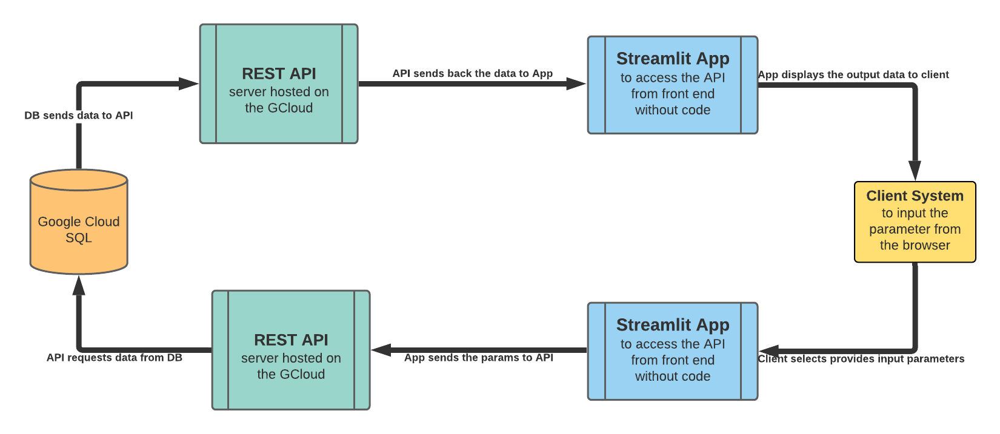


Purpose of the this hands-on project was to create a REST API inference server that serves inferences from a Transformers NLP model

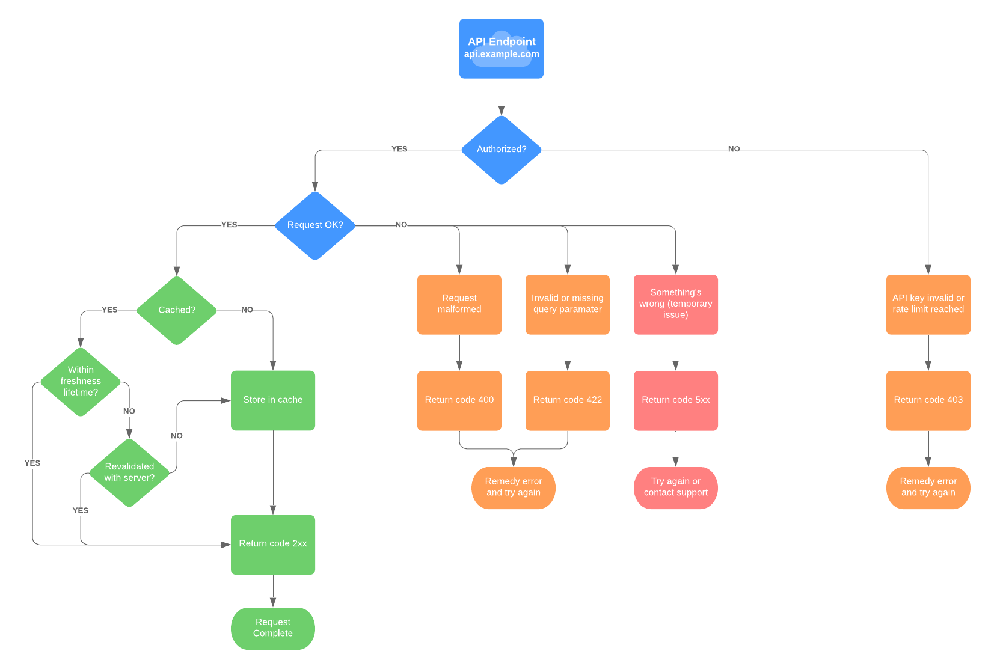

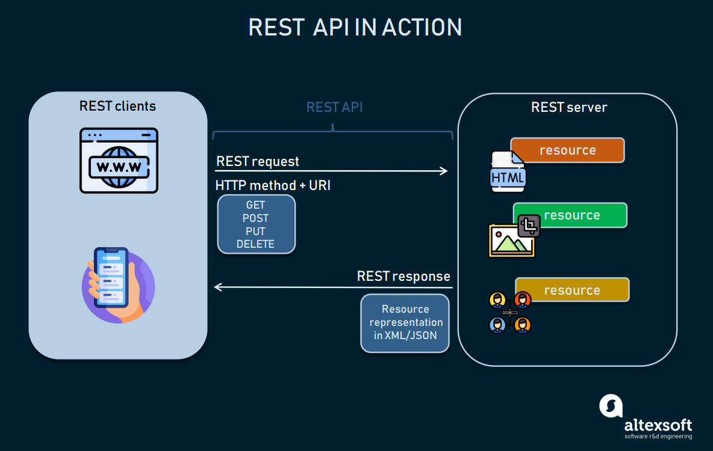

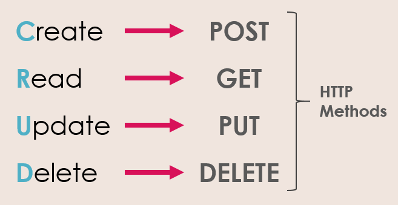

## Outline

- Part 1 - About Streamlit 

- Part 2 - Running the app Locally

- Part 3 - Dependencies

- Part 4 - REST API endpoints

- Part 5 - Building and running the API locally

- Part 6 - CI/CD with Github Actions and Google Cloud Run


## Part 1 - About Streamlit

Streamlit is an open-source Python library that makes it easy to build beautiful custom web-apps for machine learning and data science.

To use it, just pip install streamlit, then import it, write a couple lines of code, and run your script with streamlit run [filename]. Streamlit watches for changes on each save and updates the app live while you’re coding. Code runs from top to bottom, always from a clean state, and with no need for callbacks. It’s a simple and powerful app model that lets you build rich UIs incredibly quickly. To learn more about how Streamlit works, see Main concepts.

You may also want to check out this four-part video recorded at our PyData talk on December 2019. In it we describe the motivation behind Streamlit, then go over how to install and create apps with it.

## Installation Steps

1. Make sure that you have Python 3.6 or greater installed.
2. Install Streamlit using PIP:
   * pip install streamlit


## ## Usage
### Without Docker
To run the dashboard, please execute the following from the root directory:

```bash
pip3 install -r requirements.txt
streamlit run dashboard.py
```

When run locally, the dashboard is accessible here:
```
http://localhost:8501
```


### With Docker
To run the web app using Docker containers, please execute the following from the root directory:

```bash
docker build -t dashboard .
docker run -d --name dashboard -p 8501:8501 dashboard
```


## Part -3 Dependencies

The Dependencies are in the `requirements.txt` namely:

Flask==1.1.2

transformers[torch]==4.2.2

requests==2.25.1

streamlit==0.82.0

pandas==1.1.5

pytest==6.2.4

freezegun==1.1.0

mock==4.0.3

if you want to exactly rebuild the development environment
run the following command:

    (venv) $ pip install -r requirements.txt
    
The required packages are outdated very quickly and you can try to use newer versions.
If you experience problems you can always go back and use the version specified here.

To generate your own requirements file use

    (venv) $ pip freeze >requirements.txt 


## Part 4 - CI/CD with Github Actions and Google Cloud Runs

To automate the process of building and deploying images to Google Cloud Run, we can utilize Google Cloud Run GitHub Action. 

Related documentation is available [here](https://github.com/GoogleCloudPlatform/github-actions/blob/master/example-workflows/cloud-run/README.md).

# Pre-requisites

1. [Create a Google Cloud Service Account](https://cloud.google.com/iam/docs/creating-managing-service-accounts)

2. Add the following Cloud IAM roles

`Cloud Run Admin`

`Cloud Build Editor`

`Cloud Build Service Account`

`Viewer`

`Service Account User`

3. [Create a Service Account JSON key](https://cloud.google.com/iam/docs/creating-managing-service-account-keys)

4. Add a GitHub Secret to your repository:

`RUN_SA_KEY` : Content of service account JSON Key that was generated in previous step.

5. Set workflow variables

`PROJECT_ID` : Google Cloud Project ID

`SERVICE_NAME` : Service Name. This name will be used as the image name and service name.

# Example GitHub Action Workflow

```
    # Setup GCloud CLI
    - uses: GoogleCloudPlatform/github-actions/setup-gcloud@master
      with:
        version: '286.0.0'
        service_account_key: ${{ secrets.RUN_SA_KEY }}
        project_id: $PROJECT_ID

    # Build and push image to Google Container Registry
    - name: Build
      run: |-
        gcloud builds submit \
          --quiet \
          --tag "gcr.io/$PROJECT_ID/$SERVICE_NAME:$GITHUB_SHA"

    # Deploy image to Cloud Run
    - name: Deploy
      run: |-
        gcloud run deploy "$SERVICE_NAME" \
          --quiet \
          --region "$RUN_REGION" \ # E.g. centralus1
          --image "gcr.io/$PROJECT_ID/$SERVICE_NAME:$GITHUB_SHA" \
          --platform "managed" \
          --allow-unauthenticated
```

The following is a descriptive guide to use the app: 

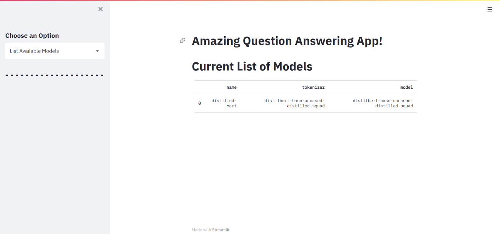


Once you access the app, this is the page you should see. Next, navigate to the 'Choose an Option' which should open a drop down menu!


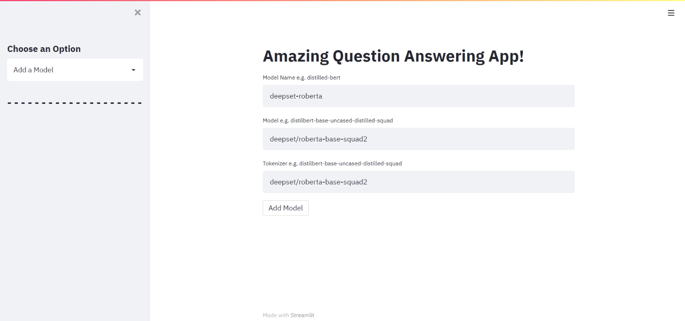

You can add a model to the app by choosing this option. 


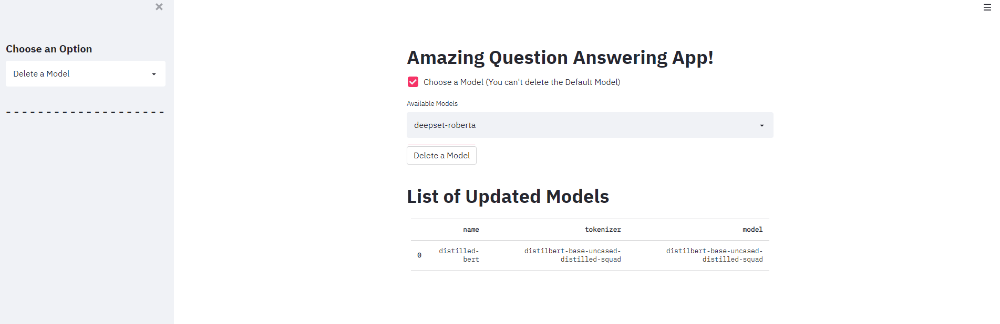


You can delete a model from the app by choosing this option. 


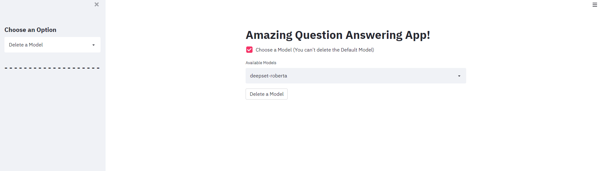


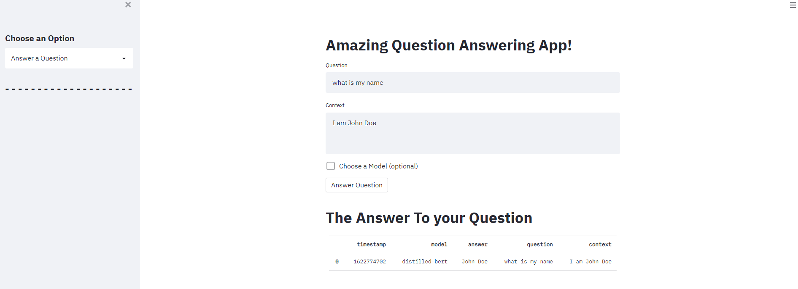


We added a file uploader where we upload a file and get answer based on question and context

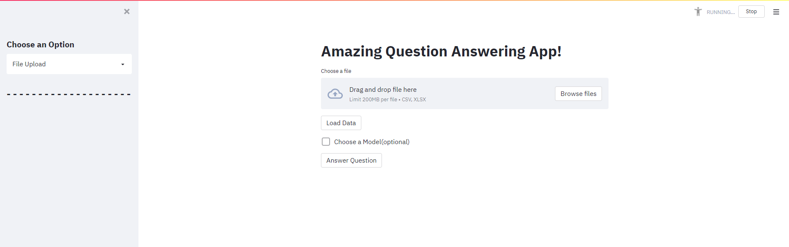

